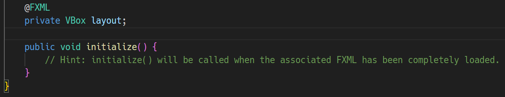
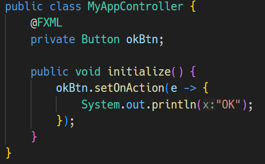

# JavaFX Controller Support

This VSCode extension provides support for FXML controllers in JavaFX projects.

- Detection and correction of `fx:id` errors.
- Displays diagnostics for invalid `fx:controller`.
- Offers a Code Lens option to add an `initialize` method if it is missing from the controller class.

# Features

## (1) Detection and Correction of fx:id Errors

Displays diagnostics when an `fx:id` in the FXML does not have a corresponding `@FXML` field in the controller class.

### 🛠️ Automatically Adds Necessary @FXML Fields

Adds the required `@FXML` fields for `fx:id` individually through Quick Fix.

### 🔍 Code Lens Option for Missing @FXML Fields

Provides a Code Lens option, "Add all missing @FXML fields," to automatically add all missing `@FXML` fields for `fx:id`.

### 📺 Diagnostics for Incorrect `@FXML` Fields

Displays diagnostics when an `@FXML` field specified in the controller class does not have a corresponding `fx:id` in the FXML.

## (2) Diagnostics for Invalid `fx:controller`

💡 `fx:controller` must be specified in the FXML file.

💡 Controller class not found.

## (3) Code Lens Option to Add initialize Method

Press "Add public void initialize() method" to add the `initialize` method.

Result:

# Miscellaneous

## Limitations

This plugin does not support references to event handlers using `@FXML`, and there are no plans to support them.

Please reference the element using `fx:id` and set the event handler in the controller class.

## Requirements

- Java and FXML files must be located within the `src` directory. For example, place Java files in `src/main/java/com/example/FooController.java` and FXML files in `src/main/resources/com/example/foo.fxml`.
- `fx:controller` must be specified in the FXML file. `FXMLLoader.setController()` is not supported.
- This extension will not function correctly unless there is a class in the project that extends `javafx.application.Application`.

## Extension Settings

This extension does not contribute any settings.

## Issues

https://github.com/sosuisen/javafx-controller-support/issues

## Release Notes

### 1.2.0

- Builder Class Generator has been separated into the [JavaFX Builder Class Generator](https://marketplace.visualstudio.com/items?itemName=sosuisha.javafx-builder-class-generator) extension.

### 1.1.0

- Added Builder Class Generator.

### 1.0.0

- Initial release.
